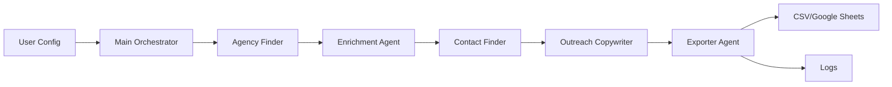

# Design Document

## Overview

The Agency LeadGen AI system is a multi-agent pipeline built on CrewAI that automates the discovery, enrichment, and outreach preparation for social media marketing agencies. The system orchestrates five specialized agents in a sequential workflow, where each agent performs a specific task and passes enriched data to the next agent in the pipeline.

The architecture follows a linear pipeline pattern where data flows from discovery through enrichment, contact finding, message generation, and finally export. This design ensures that each lead is progressively enriched with more information as it moves through the system.

## Architecture

### High-Level Architecture



### Agent Pipeline Flow

The system uses CrewAI's sequential task execution model where agents work in a defined order:

1. **Agency Finder** discovers agencies and creates initial Lead Records
2. **Enrichment Agent** adds business intelligence to each Lead Record
3. **Contact Finder** identifies decision-makers and contact information
4. **Outreach Copywriter** generates personalized messages
5. **Exporter Agent** saves all leads to persistent storage

### Technology Stack

- **Agent Framework**: CrewAI for agent orchestration and task management
- **LLM**: OpenAI GPT-4o-mini for agent reasoning and content generation
- **Web Scraping**: BeautifulSoup4 and requests for website content extraction
- **Data Export**: Python csv module and gspread for Google Sheets integration
- **Configuration**: Python config.py for centralized settings
- **Runtime**: Python 3.10+

## Components and Interfaces

### 1. Main Orchestrator (main.py)

The entry point that initializes the CrewAI crew and executes the pipeline.

**Responsibilities:**
- Load configuration from config.py
- Initialize all agents and tools
- Create CrewAI crew with sequential task execution
- Execute the crew and handle results
- Display execution summary

**Interface:**
```python
def main():
    """Execute the lead generation pipeline"""
    # Load config
    # Initialize crew
    # Execute pipeline
    # Display summary
```

### 2. Crew Configuration (crew.py)

Defines the CrewAI crew structure with all agents and their tasks.

**Responsibilities:**
- Define agent roles, goals, and backstories
- Create tasks for each agent with clear descriptions
- Configure task dependencies and execution order
- Set up agent tools and LLM configuration

**Interface:**
```python
class LeadGenCrew:
    def __init__(self, config):
        self.config = config
        self.agents = self._create_agents()
        self.tasks = self._create_tasks()
    
    def _create_agents(self) -> List[Agent]:
        """Create all agents with their configurations"""
    
    def _create_tasks(self) -> List[Task]:
        """Create tasks for the pipeline"""
    
    def get_crew(self) -> Crew:
        """Return configured CrewAI crew"""
```

### 3. Agency Finder Agent

**Role:** Research specialist for discovering marketing agencies

**Tools:**
- WebSearchTool: Search Clutch.co, Sortlist, Google Maps
- WebScraperTool: Extract agency listings from search results

**Input:**
- target_country: str
- target_count: int
- search_query: str (e.g., "social media marketing agency")

**Output:**
```python
[
    {
        "agency_name": str,
        "website": str,
        "country": str
    }
]
```

**Implementation Location:** `agents/finder_agent.py`

### 4. Enrichment Agent

**Role:** Business intelligence analyst for agency profiling

**Tools:**
- WebScraperTool: Extract content from agency websites
- ContentAnalyzerTool: Analyze services and niche from website content

**Input:** List of agencies with name and website

**Output:** Enriched Lead Records with additional fields:
```python
{
    "agency_name": str,
    "website": str,
    "country": str,
    "services": str,
    "niche": str,
    "notes": str,
    "enrichment_status": str  # "complete" or "incomplete"
}
```

**Implementation Location:** `agents/enrichment_agent.py`

### 5. Contact Finder Agent

**Role:** Contact research specialist

**Tools:**
- WebScraperTool: Extract contact pages and team pages
- EmailExtractorTool: Parse email addresses from HTML content

**Input:** Enriched Lead Records

**Output:** Lead Records with contact information:
```python
{
    ...previous_fields,
    "contact_name": str,
    "email": str,
    "contact_status": str  # "found" or "not_found"
}
```

**Implementation Location:** `agents/contact_agent.py`

### 6. Outreach Copywriter Agent

**Role:** Cold email copywriting specialist

**Tools:**
- LLM (GPT-4o-mini) for message generation

**Input:** Lead Records with agency and contact information

**Output:** Lead Records with outreach message:
```python
{
    ...previous_fields,
    "outreach_message": str,
    "message_length": int
}
```

**Message Template Guidelines:**
- Maximum 120 words
- Personalized opening referencing agency specifics
- Value proposition
- Clear CTA for 15-minute call
- Professional but conversational tone

**Implementation Location:** `agents/outreach_agent.py`

### 7. Exporter Agent

**Role:** Data persistence specialist

**Tools:**
- CSVExportTool: Write leads to CSV file
- GoogleSheetsExportTool: Append leads to Google Sheets (optional)

**Input:** Complete Lead Records with all fields

**Output:**
- CSV file at configured path
- Google Sheets update (if configured)
- Execution log file

**CSV Schema:**
```
agency_name,country,website,services,niche,contact_name,email,lead_score,outreach_message
```

**Implementation Location:** `agents/exporter_agent.py`

## Data Models

### Lead Record

The core data structure that flows through the pipeline:

```python
from dataclasses import dataclass
from typing import Optional

@dataclass
class LeadRecord:
    # Discovery phase
    agency_name: str
    website: str
    country: str
    
    # Enrichment phase
    services: Optional[str] = None
    niche: Optional[str] = None
    notes: Optional[str] = None
    enrichment_status: str = "pending"
    
    # Contact phase
    contact_name: Optional[str] = None
    email: Optional[str] = None
    contact_status: str = "pending"
    
    # Outreach phase
    outreach_message: Optional[str] = None
    message_length: Optional[int] = None
    
    # Scoring
    lead_score: str = "Cold"  # Hot/Warm/Cold
    
    def calculate_lead_score(self):
        """Calculate lead score based on data completeness"""
        if self.email and self.enrichment_status == "complete":
            self.lead_score = "Hot"
        elif self.website and self.services:
            self.lead_score = "Warm"
        else:
            self.lead_score = "Cold"
```

### Configuration Model

```python
from dataclasses import dataclass

@dataclass
class Config:
    # LLM settings
    llm_model: str = "gpt-4o-mini"
    openai_api_key: str = ""
    
    # Search parameters
    target_country: str = "Finland"
    target_count: int = 20
    search_query: str = "social media marketing agency"
    
    # Output settings
    output_file: str = "outputs/leads.csv"
    log_file: str = "outputs/logs.txt"
    
    # Google Sheets (optional)
    use_google_sheets: bool = False
    google_sheet_id: Optional[str] = None
    
    # Future features
    send_emails: bool = False
```

## Tools Implementation

### WebSearchTool

Searches multiple sources for agency listings.

```python
class WebSearchTool:
    def search_clutch(self, country: str, query: str) -> List[Dict]:
        """Search Clutch.co for agencies"""
    
    def search_sortlist(self, country: str, query: str) -> List[Dict]:
        """Search Sortlist for agencies"""
    
    def search_google_maps(self, country: str, query: str) -> List[Dict]:
        """Search Google Maps for agencies"""
```

**Implementation Location:** `tools/web_search_tool.py`

### WebScraperTool

Extracts content from agency websites.

```python
class WebScraperTool:
    def scrape_website(self, url: str) -> Dict:
        """Scrape website content and structure"""
        # Returns: {
        #     "text_content": str,
        #     "links": List[str],
        #     "contact_page_url": Optional[str]
        # }
    
    def extract_contact_page(self, url: str) -> Dict:
        """Extract contact information from contact page"""
```

**Implementation Location:** `tools/web_search_tool.py`

### EmailExtractorTool

Parses email addresses from HTML content.

```python
class EmailExtractorTool:
    def extract_emails(self, html_content: str) -> List[str]:
        """Extract email addresses using regex"""
    
    def find_decision_maker_email(self, emails: List[str], context: str) -> Optional[str]:
        """Identify most likely decision-maker email"""
```

**Implementation Location:** `tools/email_finder_tool.py`

### CSVExportTool

Handles CSV file operations.

```python
class CSVExportTool:
    def export_leads(self, leads: List[LeadRecord], output_path: str):
        """Export leads to CSV file"""
    
    def append_leads(self, leads: List[LeadRecord], output_path: str):
        """Append leads to existing CSV"""
```

**Implementation Location:** `tools/sheets_export_tool.py`

### GoogleSheetsExportTool

Handles Google Sheets integration (optional).

```python
class GoogleSheetsExportTool:
    def __init__(self, credentials_path: str):
        """Initialize with Google service account credentials"""
    
    def append_leads(self, leads: List[LeadRecord], sheet_id: str):
        """Append leads to Google Sheet"""
```

**Implementation Location:** `tools/sheets_export_tool.py`

## Error Handling

### Error Handling Strategy

The system uses a "continue on error" approach where individual lead failures don't stop the entire pipeline.

**Error Categories:**

1. **Network Errors** (website unreachable, timeout)
   - Log error
   - Mark lead with incomplete status
   - Continue to next lead

2. **Parsing Errors** (malformed HTML, missing data)
   - Log error with context
   - Use partial data if available
   - Mark fields as unavailable

3. **API Errors** (rate limits, authentication)
   - Implement exponential backoff
   - Log error
   - Skip affected operation

4. **Configuration Errors** (missing API keys, invalid paths)
   - Fail fast at startup
   - Display clear error message
   - Prevent execution

**Error Logging:**

```python
import logging

logging.basicConfig(
    level=logging.INFO,
    format='%(asctime)s - %(name)s - %(levelname)s - %(message)s',
    handlers=[
        logging.FileHandler('outputs/logs.txt'),
        logging.StreamHandler()
    ]
)
```

**Retry Logic:**

```python
from tenacity import retry, stop_after_attempt, wait_exponential

@retry(
    stop=stop_after_attempt(3),
    wait=wait_exponential(multiplier=1, min=2, max=10)
)
def fetch_website_content(url: str) -> str:
    """Fetch website with retry logic"""
```

## Testing Strategy

### Unit Testing

Test individual components in isolation:

- **Agent Logic**: Test each agent's decision-making with mock data
- **Tools**: Test web scraping, email extraction, export functions
- **Data Models**: Test Lead Record scoring and validation
- **Configuration**: Test config loading and validation

**Test Files:**
- `tests/test_agents.py`
- `tests/test_tools.py`
- `tests/test_models.py`

### Integration Testing

Test agent pipeline with real data:

- **End-to-End Pipeline**: Run full pipeline with small dataset (5 agencies)
- **Tool Integration**: Test actual web scraping on known websites
- **Export Integration**: Test CSV and Google Sheets export

**Test Files:**
- `tests/test_pipeline.py`
- `tests/test_integration.py`

### Manual Testing

- Run system with different target countries
- Verify output quality and message personalization
- Check CSV format and data completeness
- Validate lead scoring accuracy

### Test Data

Create mock agency data for testing:

```python
MOCK_AGENCIES = [
    {
        "agency_name": "Test Agency",
        "website": "https://example.com",
        "country": "Finland"
    }
]
```

## Performance Considerations

### Rate Limiting

- Implement delays between web requests (1-2 seconds)
- Respect robots.txt for web scraping
- Use connection pooling for HTTP requests

### Concurrency

- Process leads sequentially in MVP
- Future: Implement parallel processing for enrichment phase
- Use asyncio for concurrent web requests

### Caching

- Cache website content to avoid repeated requests
- Store scraped data temporarily during execution
- Clear cache between runs to ensure fresh data

### Resource Management

- Close HTTP connections properly
- Limit memory usage by processing leads in batches
- Clean up temporary files after execution

## Security Considerations

- Store API keys in environment variables, not in code
- Use .env file for local development
- Add .env to .gitignore
- Validate and sanitize all user inputs
- Use HTTPS for all external requests
- Implement request timeouts to prevent hanging
- Log security-relevant events (failed authentications, etc.)

## Future Enhancements (Phase 2)

These features are out of scope for MVP but designed into the architecture:

1. **Email Sending via SendGrid**
   - Add SendGridTool in `tools/sendgrid_tool.py`
   - Implement manual approval workflow
   - Track email delivery status

2. **Lead Deduplication**
   - Check existing leads before adding new ones
   - Use website URL as unique identifier
   - Merge duplicate records

3. **CRM Integration**
   - HubSpot API integration
   - Sync leads to CRM automatically
   - Update lead status from CRM

4. **Scheduling**
   - Daily automated runs via cron
   - Incremental lead discovery
   - Email digest of new leads

5. **Multi-language Support**
   - Detect agency language
   - Generate outreach in appropriate language
   - Support multiple target countries simultaneously
